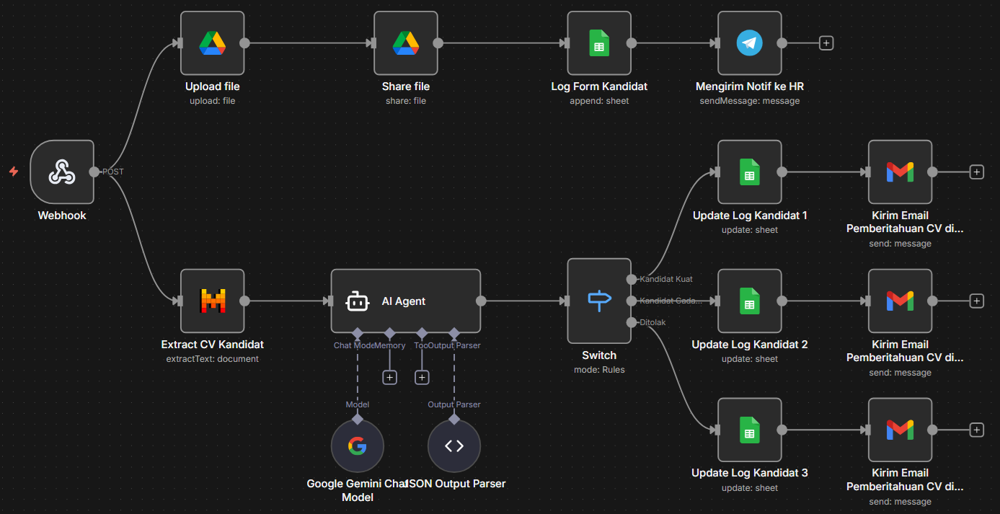
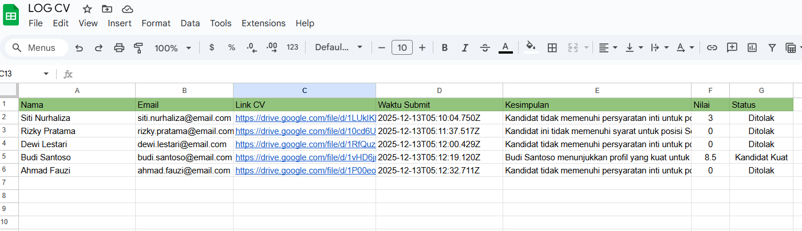
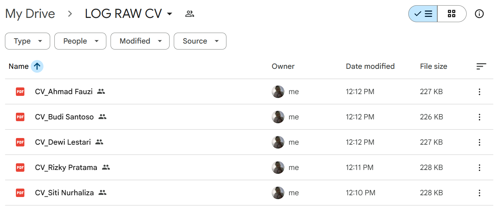
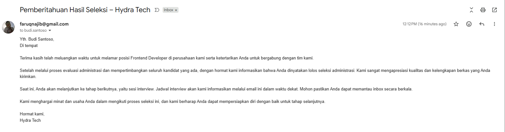
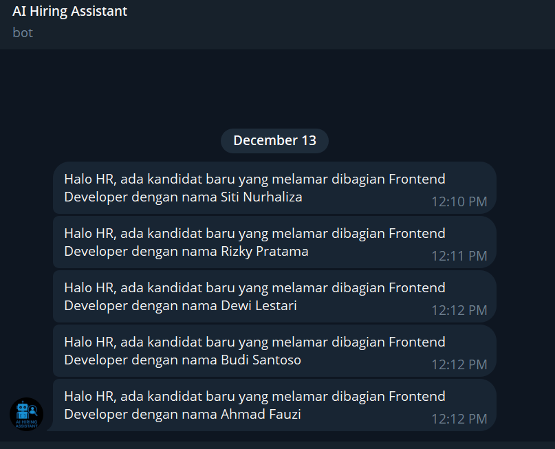

# AI-Hiring-Assistant: Simulasi Perekrutan Otomatis dengan n8n

[WARNING !] Gunakan data dummy jika ingin mencoba  
Demo : https://faruqtokbae.vercel.app/  
Google Drive : https://drive.google.com/drive/folders/1Cg6CJJ7MQ1LfI-ufSjhSOCnoyAVT05aL?usp=sharing  
Google Sheet : https://docs.google.com/spreadsheets/d/1zIlQH7cvFn91M0J76WVqnZ6z5jwucguAmLufQQB2pdA/edit?usp=sharing

Proyek ini adalah sebuah demonstrasi implementasi alur kerja (*workflow*) perekrutan yang cerdas dan otomatis. Menggunakan **n8n** sebagai *backend* automasi dan diintegrasikan dengan AI, proyek ini menunjukkan bagaimana proses dari lamaran hingga seleksi awal dapat diotomatisasi secara *end-to-end*.

Landing page yang tersedia dalam repositori ini berfungsi sebagai antarmuka dari sistem, yaitu sebuah situs web perusahaan fiktif yang sedang membuka lowongan pekerjaan.

## 📜 Konsep Proyek

Tujuan utama proyek ini adalah untuk memvisualisasikan bagaimana AI dan automasi dapat mentransformasi proses rekrutmen. Alur kerjanya adalah sebagai berikut:

1.  **Start Point (User Interface)**: Kandidat mengunjungi landing page perusahaan dan mengisi formulir lamaran.
2.  **Trigger Automation**: Pengiriman formulir tersebut berfungsi sebagai *webhook* yang memicu alur kerja di **n8n**.
3.  **AI Process & Automation (n8n Workflow)**:
    *   Data kandidat diterima dan diproses.
    *   AI diintegrasikan untuk melakukan *screening* awal, seperti analisis CV, pencocokan kata kunci, atau penilaian ringkasan.
    *   Sistem secara otomatis mengirimkan email konfirmasi kepada kandidat.
    *   Data kandidat disimpan ke dalam database atau Google Sheets untuk pelacakan lebih lanjut.
    *   Notifikasi dikirimkan ke tim HR (misalnya, melalui WA, telegram atau email) mengenai lamaran baru yang masuk.
4.  **Hasil Akhir**: Proses manual yang berulang dapat diminimalkan, memungkinkan tim HR untuk fokus pada kandidat yang paling memenuhi syarat.

## 📈 Dampak & Potensi Penghematan

Dengan mengotomatisasi tugas-tugas rekrutmen yang repetitif, proyek ini menawarkan potensi penghematan yang signifikan baik dari segi waktu maupun biaya.

### Penghematan Waktu

Estimasi penghematan waktu bisa mencapai **70-80%** pada tahap seleksi administrasi awal.

| Tugas Manual Tradisional | Otomatisasi dengan Proyek Ini |
| :--- | :--- |
| Membaca ratusan CV & email secara manual | AI melakukan screening kata kunci & kualifikasi dalam hitungan detik. |
| Mengirim email konfirmasi satu per satu | Email balasan terkirim otomatis begitu lamaran diterima. |
| Input data kandidat ke spreadsheet manual | Data otomatis tersimpan di database/Google Sheets via n8n. |
| Memberi notifikasi manual ke manajer perekrutan | Notifikasi otomatis terkirim ke Telegram manajer. |

### Penghematan Biaya (Budget)

Penghematan waktu ini secara langsung berdampak pada pengurangan biaya operasional rekrutmen.

*   **Mengurangi Jam Kerja SDM**: Dengan berkurangnya pekerjaan administratif hingga puluhan jam per minggu, tim HR dapat mengalihkan fokus ke tugas strategis seperti wawancara mendalam, negosiasi, dan *employer branding*.
*   **Menurunkan *Cost-per-Hire***: Proses yang lebih efisien dan cepat secara langsung menurunkan biaya yang dikeluarkan untuk setiap kandidat yang berhasil direkrut.
*   **Mempercepat *Time-to-Hire***: Posisi kosong dapat terisi lebih cepat, mengurangi kerugian produktivitas akibat kekosongan jabatan. Secara konservatif, implementasi sistem ini dapat menghemat budget dalam biaya operasional, tergantung pada volume rekrutmen perusahaan.

## 🖼️ Visualisasi Alur Kerja (Contoh Hasil)

Berikut adalah gambaran visual dari setiap langkah utama dalam alur kerja automasi ini.

### 1. Alur Kerja Automasi di n8n
Ini adalah otak dari operasi. Alur kerja di n8n ini menerima data dari formulir, memprosesnya, dan mendistribusikan informasi ke berbagai layanan secara otomatis.



---

### 2. Penyimpanan Data Otomatis di Google Sheets
Setelah kandidat mengirimkan lamaran, data mereka secara instan dan otomatis masuk ke dalam Google Sheets dan Google Drive, menciptakan database kandidat yang terstruktur tanpa perlu input manual.




---

### 3. Email Konfirmasi Otomatis untuk Kandidat
Pada saat yang sama, sistem mengirimkan email konfirmasi yang dipersonalisasi kepada kandidat, memberi tahu mereka bahwa lamaran telah diterima. Ini meningkatkan pengalaman kandidat.



---

### 4. Notifikasi Real-time untuk Tim HR
Tim perekrutan langsung mendapatkan notifikasi (Telegram) begitu ada lamaran baru yang masuk, memungkinkan mereka untuk bertindak cepat.



## ✨ Fitur Demonstrasi

*   **Landing Page Perusahaan**: Halaman web statis yang mensimulasikan situs karier sebuah perusahaan.
*   **Formulir Lamaran Interaktif**: Formulir yang berfungsi sebagai start point untuk memulai alur kerja automasi di n8n.
*   **Arsitektur Fleksibel**: Menunjukkan bagaimana antarmuka (HTML/CSS/JS) dapat dihubungkan dengan *backend* automasi yang kuat seperti n8n.

## 🚀 Teknologi yang Digunakan

*   **Frontend (Contoh Antarmuka)**:
    *   **HTML**: Struktur halaman web.
    *   **CSS**: Desain dan *styling*.
    *   **JavaScript**: Fungsionalitas formulir dan pengiriman data ke *webhook* n8n.
*   **Backend & Automasi**:
    *   **n8n.io**: Platform inti yang menjalankan seluruh alur kerja automasi, mulai dari menerima data, memprosesnya, hingga melakukan tindakan (mengirim email, menyimpan data, dll.).
    *   **AI**: Dapat diintegrasikan dalam alur kerja n8n melalui API ke layanan seperti OpenAI, Gemini, Hugging Face, atau model lainnya.

## 🛠️ Cara Menggunakan dan Mengembangkan

Untuk menjalankan simulasi ini, Anda perlu menghubungkan landing page ini ke alur kerja n8n Anda.

1.  **Siapkan Alur Kerja n8n Anda:**
    *   Buat alur kerja baru di n8n.
    *   Gunakan node `Webhook` sebagai pemicu (*trigger*).
    *   Salin URL *webhook* yang disediakan oleh n8n.

2.  **Konfigurasi Landing Page:**
    *   Clone repositori ini:
        ```bash
        gh repo clone faruqnajib/AI-Hiring-Assistant
        ```
    *   Buka file JavaScript (`.js`) yang bertanggung jawab untuk pengiriman formulir.
    *   Tempelkan URL *webhook* n8n Anda sebagai tujuan pengiriman data formulir.

3.  **Jalankan Proyek:**
    *   Buka file `index.html` di peramban Anda.
    *   Isi dan kirimkan formulir lamaran.
    *   Periksa alur kerja n8n Anda untuk melihat eksekusi yang berhasil.
